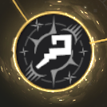

# **Potential Liberation**

Potential Liberation (often called **"Pots"**) is the system used to upgrade a costume's performance and a character's stats.

## { .icon-header } **Costume Bonds**
Beforehand, you must understand **Bonds**.

* Each character can "Bond" with **one** specific costume at a time.
* The character gains additional stats based on the *Potential Liberation* progress of that specific bonded costume.

!!! question "**How to switch bonds?**"
    Go to the Character screen and click the costume portrait on the right side.
    ??? note "Image Guide"
        

!!! example "**How to choose bond?**"
    It is important to choose a proper bond. 

    ---

    * **<u>If you are new, use the bond with the most potential liberation done.</u>**
    * If you are not new, you should choose depending on enemy. 
        * In **general content**, you tend to use same DPS, which means a lot of off-element fights. For that reason, you usually target bonds **with no Property *(Water, Light etc)* DMG Increase**. 
        * In **property content** *(Fiend Hunter, Guild Raid)*, you need to understand the buffs occuring in a fight. For some fights with no extra Property DMG Increase from boss itself, it *may* be worth to pick bond **with Property DMG Increase**. However, if boss offers additional buff or you have a lot of external buffs from supports, it *may* be worth to pick "general" bond instead.   
        * For **defensive / support bonds**, pick depending on damage type you are facing. 
    
    Of course, there are rare exceptions to this generalized advice and you can always rely on different guides or **[calculator](https://browndust2-wiki.souseha.com/en/option-calculator)** in case you are not sure. 

## **Liberation Nodes**
To access this menu, select desire costume in Costume tab and press **Upgrade** in the bottom right. There are three types of nodes:

### 1. Small Nodes (Permanent)

* **Effect:** Upgrades the character's **Base Stats**.
* **Condition:** Active **permanently**, regardless of which costume is bonded.
* **Cost:** 
    * 30K {{ Gold }}
    * 50 Elemental Crystals

### 2. Medium Nodes (Bond-Dependent)

* **Effect:** Grants significant stat boosts.
* **Condition:** Active **ONLY** when this specific costume is Bonded.
* **Cost:** 
    * 20 ~ 40K {{ Gold }}
    * 0 ~ 350 Elemental Crystals

### 3. Large Nodes (Skill Upgrades)

* **Effect:** Directly enhances the skill (e.g., **-1 SP Cost**, **+ Range**, **+ Damage %**).
* **Cost:** 
    * 500 Elemental Crystals
    * 1 {{ Tear_of_Goddess }} **Tear of Goddess**.

## **Investment Strategy**

!!! warning "Warning"
    Potential Liberation cannot be undone. **Tears of Goddess** are a limited resource, so spend them wisely.

**Priority List:**
1.  **Buffers:** SP Reduction and Cooldown reduction are usually top priority.
2.  **DPS:** Look for "Quality of Life" upgrades (like Range increases) rather than just raw damage.

!!! quote "External Resources"
    For a detailed tier list and calculator, check out **[Cymmina's Potential Guide](http://cymmina.gamependium.com/browndust2/growth.html#potentials)**.

<!--Potential Liberation, also commonly known as pots, is a good way to upgrade the performance of a particular costume. 
Before we check them, let’s have a small talk about costume bonds. 
Each companion can bond one costume. Depending on chosen costume and progress in potential liberation, you can get additional stats to enhance your character. To switch the bond, choose a character and click on the costume portrait on the right near the glowing star.  
Now, to access potential liberation feature, go to the specific character, then go to the costume tab, pick the desired costume and press the upgrade button in the right bottom corner. 
Here you will see three different types of nodes you can upgrade. Most nodes require the use of gold and elemental crystals, with some exceptions.
Let’s start from the smallest white ones. These nodes upgrade companion’s permanent stats regardless of the costume you bond. These nodes usually share the same attribute amongst themselves and have relatively low price to liberate.
Middle-sized nodes are the most common ones. They offer you extra stats only if you have this particular costume bound. These are cheap at the start and get more expensive the closer you are to big nodes.
And lastly, big nodes. These are the most important ones as they enhance the costume directly, increasing range, reducing costume SP cost or cooldown, and changing damage or buff percentage etc. They cost 500 elemental crystals and 1 Tear of Goddess each. 
Keep in mind that liberation is permanent and there is no way to undo it. Given the fact that tears are limited, you should wisely spend them. As a new player, your priority should mainly be buffers, alongside some small QoL upgrades for DPS such as increased range for Sacred Justia etc. You can check additional information about pots, as well as a table of top-priority liberations, in this very useful site made by Cymmina-->
