## **Overview**

Evil Castle - PvE mode, offering both single-time and repetitive content.

!!! abstract "Unlock Requirement"
    Clear **Story Pack 4 "Cat Daddy" (Normal Diffuculty)**.

**Evil Castle Consists of 5 Towers:**   
<table>
    <tr>
        <td><b><a href="#tower-of-pride">Tower of Pride</a></b></td><td><b><a href="#tower-of-desire">Tower of Desire</a></b></td><td><b><a href="#tower-of-salvation">Tower of Salvation</a></b></td><td><b><a href="#tower-of-wrath">Tower of Wrath</a></b></td><td><b><a href="#tower-of-jealousy">Tower of Jealousy</a></b></td>
    </tr>
</table>

---

### { .icon-header } **Tower of Desire**

Often considered to be a general content (until Floor 151+). 

!!! info ""
    * **Height:** 200 floors
    * **Enemy Property:** Enemies share one **Property** for 10 floors, then it changes.
    * **Progression:** To advance, you just need to win the battle. Completing the 2 optional challenges per floor grants extra resources.

!!! question "Who to use for this tower?"
    * **You can use your general (Story) team until Floor 151. Having correct Property is adviced but not necessarily needed.**
    * **Starting from Floor 151, you <u>must</u> utilize Property damage bonus, meaning you need to use <u>Diana</u> and <u>correct DPS</u> for each stage. You can experiment on your own or refer to [Seji's Video Guide](https://www.youtube.com/watch?v=JCN2n4DWRYA).**

??? info "Tower of Pride Rewards"

    * **Each 10th Floor:** 1 {{ Draw_Ticket }}, 150 {{ Dia }}, 10 {{ Ancient_Crystal }}
    * **Each 5th Floor:** 1 {{ Draw_Ticket }}, 100 {{ Dia }}, 5 {{ Ancient_Crystal }}
    * **Rest Floors:** 1 {{ Draw_Ticket }}, 30 000 {{ Gold }}, 5 {{ Cooked_Rice }}

<figure markdown>

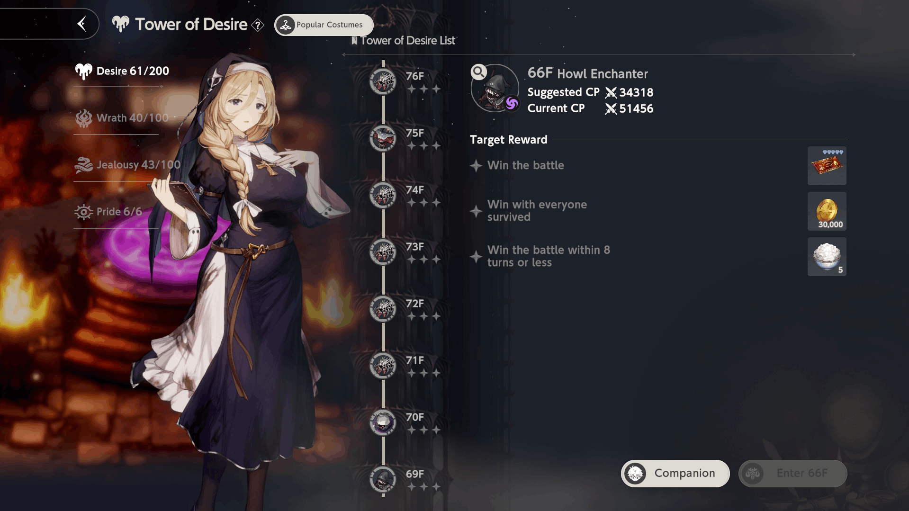

<figcaption>Tower of Desire Menu</figcaption>

</figure>

<figure markdown>

<figcaption>Tower of Desire Battle Screen</figcaption>

</figure>

---

### { .icon-header } **Tower of Pride**

Tower of Pride is a unique Tower, offering **daily** rewards based on your score. 

!!! info ""
    * **Height:** 6 floors
    * **Enemy Property:** Enemies share one **Property** each floor. 
        * <i>Note: Enemies do not have Light property completely.</i>
    * Each floor consists of **4 Normal Battles** and **1 Boss Battle**. You cannot do a Boss Battle until you have cleared the rest.

???+ abstract "Tower of Pride Scoring System ( \[ \+ Score ] — Boss Values )"
    === "Floor 1"
        * **Entile at least 4 character(s) with Fire prorerty: +2000 \[\+4000\]**
        * **Win the battle within 1 turns or less: +1500 \[\+3000\]**
        * **Win the battle within 3 turns or less: +1000 \[\+2000\]**
        * **Win the battle within 5 turns or less: +500 \[\+1000\]**                        
    === "Floor 2"
        * **Entile at least 4 character(s) with Light prorerty: +2000 \[\+4000\]**
        * **Win the battle within 1 turns or less: +1500 \[\+3000\]**
        * **Win the battle within 3 turns or less: +1000 \[\+2000\]**
        * **Win the battle within 5 turns or less: +500 \[\+1000\]** 
    === "Floor 3"
        * **Entile at least 4 character(s) with Water prorerty: +2000 \[\+4000\]**
        * **Win the battle within 1 turns or less: +1500 \[\+3000\]**
        * **Win the battle within 3 turns or less: +1000 \[\+2000\]**
        * **Win the battle within 5 turns or less: +500 \[\+1000\]**
    === "Floor 4"
        * **Entile at least 4 character(s) with Light prorerty: +2000 \[\+4000\]**
        * **Win the battle within 1 turns or less: +1500 \[\+3000\]**
        * **Win the battle within 3 turns or less: +1000 \[\+2000\]**
        * **Win the battle within 5 turns or less: +500 \[\+1000\]** 
    === "Floor 5"
        * **Entile at least 3 character(s) with Wind prorerty: +2000 \[\+4000\]**
        * **Win the battle within 1 turns or less: +1500 \[\+3000\]**
        * **Win the battle within 3 turns or less: +1000 \[\+2000\]**
        * **Win the battle within 5 turns or less: +500 \[\+1000\]**
    === "Floor 6"
        * **Entile at least 2 character(s) with Light prorerty: +1750 \[\+3500\]**
        * **Entile at least 2 character(s) with Darkness prorerty: +1750 \[\+3500\]**
        * **Win the battle within 3 turns or less: +1000 \[\+2000\]**
        * **Win the battle within 5 turns or less: +500 \[\+1000\]**
    ---
    !!! warning "IMPORTANT"
        Except tasks above, there are also so called <u>**Evaluation points**</u>.

        To get maximum of those, you need to:
        
        * **Deal 1,000,000 Damage by a single unit in a single turn**
        * **Complete the fight in 1 turn**
        * **Have your current team with maximum (healed) HP**
    ---
    !!! example "Total Score Points"

        * **Regular fight:** 15,000 points
        * **Boss fight:** 40,000 points
        * **Total:** 15,000 $\times$ 4 + 40,000 = **100,000** points per floor

!!! note "Newbie Advices"
    **1. It is important to complete tower at least once to start gaining resources for crafting gear.** 
    **2. <u>Do NOT chase fulfilling property requirenment as very new player.**</u>  While it is important to have as best score as possible, that task isn't as benefial and requires a lot of investment in DPS and supports you may not have.  Intstead, exploit free points from full HP and try to deal 1m damage with single-hit costumes such as Dream Bride Eclipse. Using your general team is enough for the start.

    

!!! question "Do I need to fight it daily to obtain rewards?"
    **No.** Game mode offers both one-time clear and daily rewards. For obtaining daily ones, go to any pack except Golden Colosseum and Glupy Diner and interact with pet following you. 
    ??? note "Image Guide"
        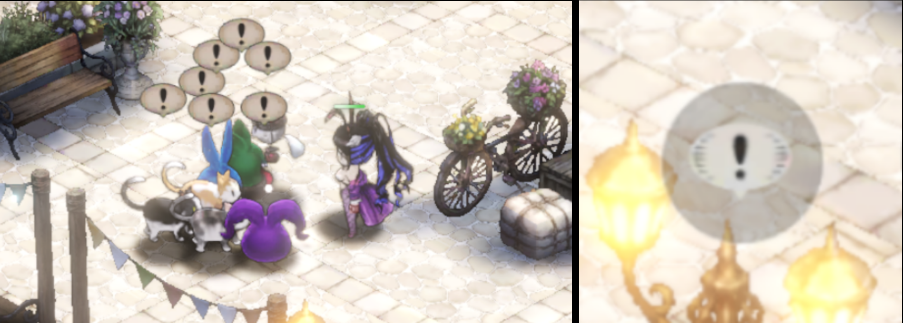

??? abstract "Tower of Desire Rewards"
    === "One-time Rewards"
        * **6th Floor:** 1,000 {{ Devil_Coin }}, 10 {{ Ancient_Crystal }}  
        * **5th Floor:** 1,000 {{ Devil_Coin }}, 10 {{ Ancient_Crystal }}  
        * **4th Floor:** 1,000 {{ Devil_Coin }}, 10 {{ Ancient_Crystal }}  
        * **3rd Floor:** 1,000 {{ Devil_Coin }}, 10 {{ Ancient_Crystal }}  
        * **2nd Floor:** 1,000 {{ Devil_Coin }}, 10 {{ Ancient_Crystal }}    
        * **1st Floor:** 1,000 {{ Devil_Coin }}, 10 {{ Ancient_Crystal }}
    === "Daily Rewards"
        * **600,000 points:** 900 {{ Devil_Coin }}, 9 {{ Ancient_Crystal }}
        * **500,000 points:** 800 {{ Devil_Coin }}, 8 {{ Ancient_Crystal }}
        * **400,000 points:** 750 {{ Devil_Coin }}, 8 {{ Ancient_Crystal }}
        * **300,000 points:** 700 {{ Devil_Coin }}, 7 {{ Ancient_Crystal }}
        * **200,000 points:** 650 {{ Devil_Coin }}, 7 {{ Ancient_Crystal }}
        * **150,000 points:** 600 {{ Devil_Coin }}, 7 {{ Ancient_Crystal }}
        * **100,000 points:** 550 {{ Devil_Coin }}, 6 {{ Ancient_Crystal }}
        * **50,000 points:** &nbsp;&nbsp;500 {{ Devil_Coin }}, 6 {{ Ancient_Crystal }}
        * **10,000 points:** &nbsp;&nbsp;300 {{ Devil_Coin }}, 6 {{ Ancient_Crystal }}

<figure markdown>

<figcaption>Tower of Pride Menu</figcaption>

</figure>

<figure markdown>

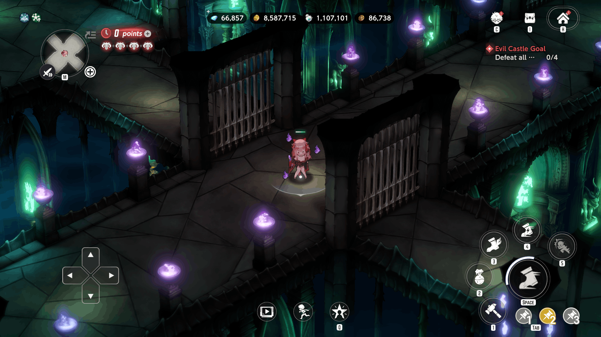

<figcaption>Tower of Pride Battle Room</figcaption>

</figure>

<figure markdown>

<figcaption>Tower of Pride Battle Room Map</figcaption>

</figure>

<figure markdown>

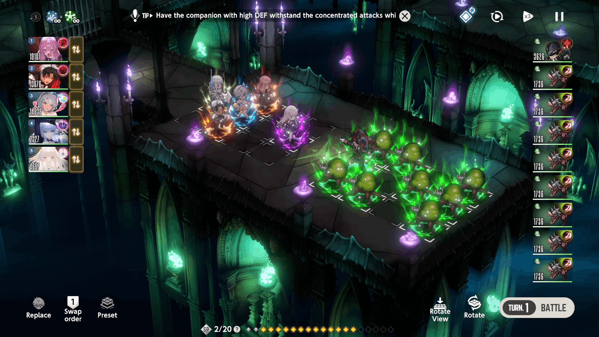

<figcaption>Tower of Pride Battle</figcaption>

</figure>

<figure markdown>

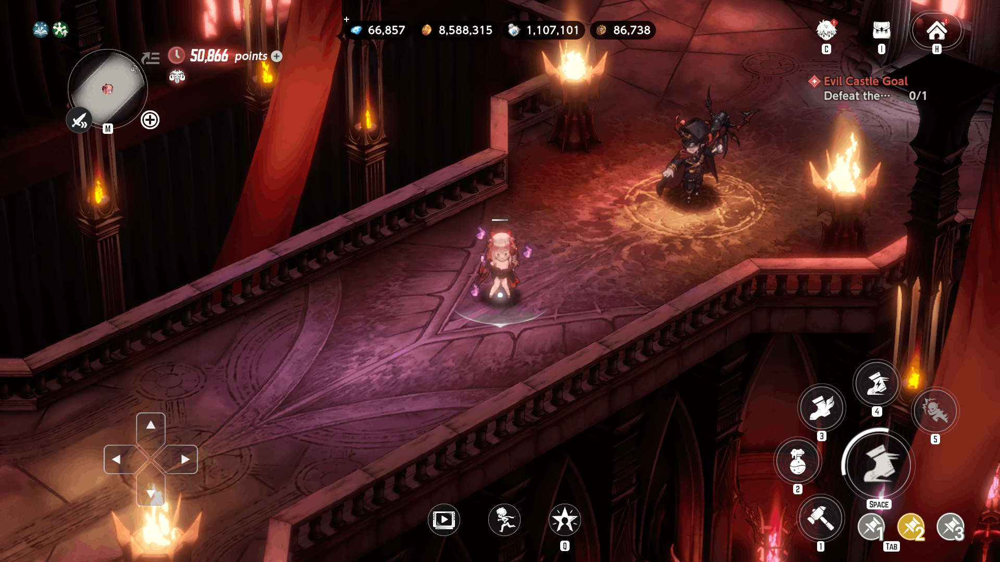

<figcaption>Tower of Pride Boss Room</figcaption>

</figure>

<figure markdown>

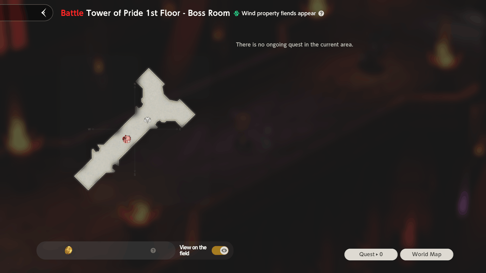

<figcaption>Tower of Pride Boss Room Map</figcaption>

</figure>

### { .icon-header } **Tower of Wrath**

This tower offers you a challenge by reducing useful character pool: **Enemies are immune to Physical Damage**.

!!! info ""
    * **Height:** 100 floors
    * **Enemies:** They **DO NOT** have property. Aside from that, they **ARE IMMUNE to Physical Damage**.
    * **Progression:** To advance, you just need to win the battle. Completing the 2 optional challenges per floor grants extra resources.
    * **Battle Environment:** Starting from Floor 11, additional effects are added for you (and / or enemy) for the next 10 floors.

!!! question "Who to use for this tower?"
    * **As should have been guessed from the tower gimmick, characters with <u>Magic Damage type</u>**.
    * **Starting from Floor 41, Tower becomes harder. Be aware of environmental challenges and find the ways to overcome them.** **Or if you fail to do so, refer to [Seji's Video Guide](https://www.youtube.com/playlist?list=PLSWDlsPYyQphb3DCFuGhXL0IfrIi90di6).**

!!! warning "Important to know"
    Despite enemies being immune to Physical Damage, it simply negates damage. **Any debuffs / knockback abilities from Physical type characters will work, which *may* or *may not* be useful for clearing the stage.** (Damage from Knockback **will** be negated, though).

??? abstract "Environmental Effects"
    * **91 — 100 Floors:** **[All Groups]**{ .orange} Crit Rate is reduced by 200%.
    * **81 — 90 Floors:** **[Monster Group]**{ .orange} Damage recieved is reduced by 50% due to the applied Barrier. **[User Group]**{ .orange } Crit DMG decreases by 200%.
    * **71 — 80 Floors:** **[Monster Group]**{ .orange} Each attack adds 1 extra Chain stack. **[User Group]**{ .orange } Crit DMG decreases by 200%.
    * **61 — 70 Floors:** **[User Group]**{ .orange} DEF is reduced by 25%. **[User Group]**{ .orange } Crit DMG decreases by 200%.    
    * **51 — 60 Floors:** **[User Group]**{ .orange} Incoming DMG increases by 200%. **[User Group]**{ .orange } Crit DMG decreases by 200%.
    * **41 — 50 Floors:** **[User Group]**{ .orange} Reinforcement skill efficiency reduces by 70%.
    * **31 — 40 Floors:** **[User Group]**{ .orange} Each attack adds one additional stack of Chain. **[User Group]**{ .orange } Incoming DMG increases by 50%.
    * **21 — 30 Floors:** **[Monster Group]**{ .orange} Each target receives an Energy Guard equivalent to 50% of Max HP.
    * **11 — 20 Floors:** **[All Groups]**{ .orange} Crit DMG increases by 100%.

??? info "Tower of Wrath Rewards"
    * **Each 50th Floor:** 10 {{ Draw_Ticket }}, 150 {{ Dia }}, 1 {{ Property_Selective_Draw_Exchange_Ticket }}
    * **Each 10th Floor:** 10 {{ Draw_Ticket }}, 150 {{ Dia }}, 200 {{ Refining_Crystal }}
    * **Each 5th Floor:** 5 {{ Draw_Ticket }}, 100 {{ Dia }}, 100 {{ Refining_Crystal }}
    * **Rest Floors:** 30 000 {{ Gold }}, 30 000 {{ Gold }}, 5 {{ Torch }}

<figure markdown>

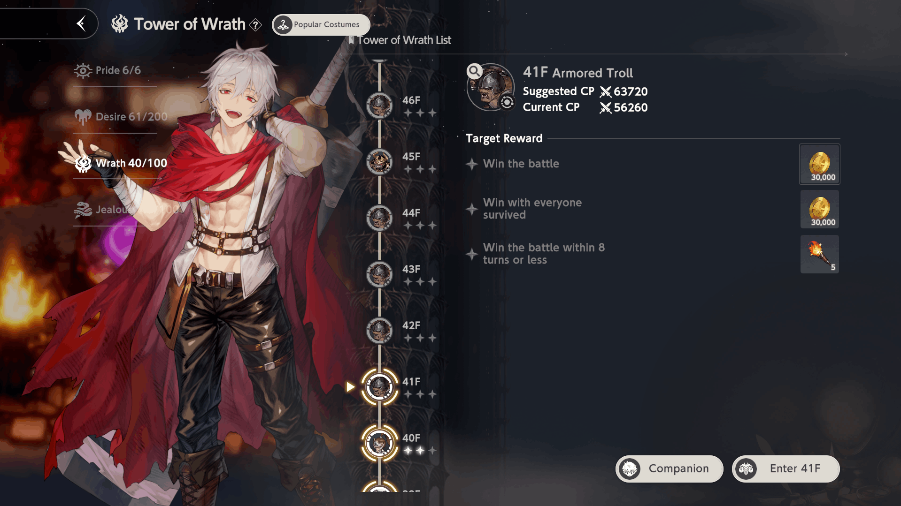

<figcaption>Tower of Wrath Menu</figcaption>

</figure>

<figure markdown>

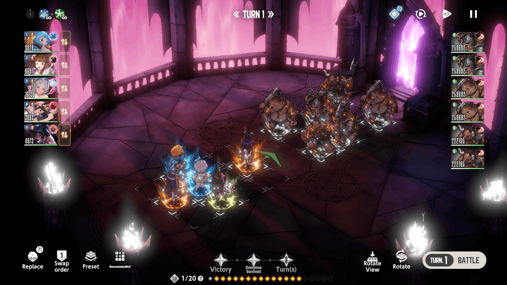

<figcaption>Tower of Wrath Battle Screen</figcaption>

</figure>

### { .icon-header } **Tower of Jealousy**

This tower offers you a challenge by reducing useful character pool: **Enemies are immune to Magical Damage**.

!!! info ""
    * **Height:** 100 floors
    * **Enemies:** They **DO NOT** have property. Aside from that, they **ARE IMMUNE to Magical Damage**.
    * **Progression:** To advance, you just need to win the battle. Completing the 2 optional challenges per floor grants extra resources.
    * **Battle Environment:** Starting from Floor 11, additional effects are added for you (and / or enemy) for the next 10 floors.

!!! question "Who to use for this tower?"
    * **As should have been guessed from the tower gimmick, characters with <u>Physical Damage type</u>**.
    * **Starting from Floor 41, Tower becomes harder. Be aware of environmental challenges and find the ways to overcome them.** **Or if you fail to do so, refer to [Seji's Video Guide](https://www.youtube.com/playlist?list=PLSWDlsPYyQphb3DCFuGhXL0IfrIi90di6).**

!!! warning "Important to know"
    Despite enemies being immune to Magical Damage, it simply negates damage. **Any debuffs / knockback abilities from Magical type characters will work, which *may* or *may not* be useful for clearing the stage.** (Damage from Knockback **will** be negated, though).

??? abstract "Environmental Effects"
    * **91 — 100 Floors:** **[All Groups]**{ .orange} Crit Rate is reduced by 200%.
    * **81 — 90 Floors:** **[User Group]**{ .orange} DEF is reduced by 25%.  **[User Group]**{ .orange } Crit DMG decreases by 200%.
    * **71 — 80 Floors:** **[Monster Group]**{ .orange} Crit Rate increases by 100%. **[User Group]**{ .orange } Crit DMG decreases by 200%.
    * **61 — 70 Floors:** **[Monster Group]**{ .orange} Each attack adds 1 extra Chain stack. **[User Group]**{ .orange } Crit DMG decreases by 200%.    
    * **51 — 60 Floors:** **[Monster Group]**{ .orange} Damage dealt increases by 100%. **[User Group]**{ .orange } Crit DMG decreases by 200%.
    * **41 — 50 Floors:** **[User Group]**{ .orange} Reinforcement skill efficiency reduces by 70%.
    * **31 — 40 Floors:** **[Monster Group]**{ .orange} Each target heals 20% of Max HP per turn.
    * **21 — 30 Floors:** **[Monster Group]**{ .orange} Damage recieved is reduced by 50% due to the applied Barrier.
    * **11 — 20 Floors:** **[All Groups]**{ .orange} Crit Rate increases by 50%.

??? info "Tower of Jealousy Rewards"
    * **Each 50th Floor:** 10 {{ Draw_Ticket }}, 150 {{ Dia }}, 1 {{ Property_Selective_Draw_Exchange_Ticket }}
    * **Each 10th Floor:** 10 {{ Draw_Ticket }}, 150 {{ Dia }}, 200 {{ Refining_Crystal }}
    * **Each 5th Floor:** 5 {{ Draw_Ticket }}, 100 {{ Dia }}, 100 {{ Refining_Crystal }}
    * **Rest Floors:** 30 000 {{ Gold }}, 30 000 {{ Gold }}, 5 {{ Torch }}

<figure markdown>

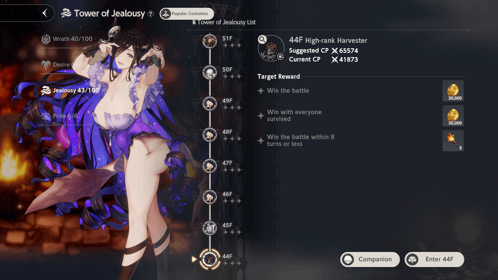

<figcaption>Tower of Jealousy Menu</figcaption>

</figure>

<figure markdown>

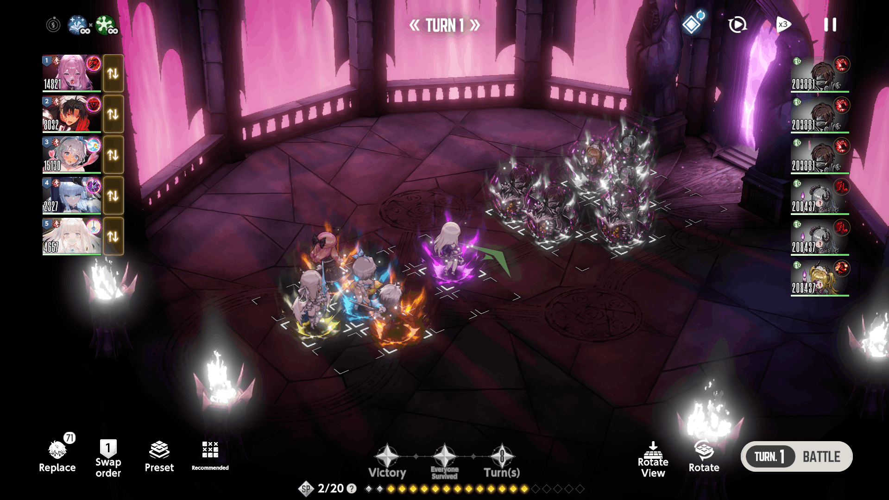

<figcaption>Tower of Jealousy Battle Screen</figcaption>

</figure>

### { .icon-header } **Tower of Salvation**

Tower of Salvation is a **seasonal** roguelike gamemode where you climb Floors of the Tower in order to obtain resources.

!!! info ""
    * <u>**Unlock Requirenment: Clear Story Pack 9 "Iron Mask" (Normal Diffuculty)**</u>.
    * **Levels:** 10 Difficulties \[ 10-30 floors each \]
    * **Season Duration:** 4 weeks with settlement period on last day (starting at {{ time('15:00') }}).

Before starting your run, you're allowed to choose a difficulty and purchase some upgrades. 
Difficulty decide how hard it will be to climb the Tower, while upgrades ease the process but require from you {{ Night_World_Obsidian }} Night World Obsidian, earned in your other runs.

??? info "Difficulty info"
    === "Lv. 1"
        * Target Floor: **10F**
        * Lost Silver at Start: **30000**
        * Silver Acquired After Battle Victory: **100%**
        * Enemy HP Ratio: **100%**
        * Enemy ATK, Magic ATK Ratio: **100%**
        * SP at Start of Battle: **20**
        * SP Recovery per Turn: **5**
        * Item Discount Probability: **25%**
    === "Lv. 2"
        * Target Floor: **10F**
        * Lost Silver at Start: **26000** **(-4000)**{ .softred }
        * Silver Acquired After Battle Victory: **100%**
        * Enemy HP Ratio: **150%** **(+50%)**{ .softred }
        * Enemy ATK, Magic ATK Ratio: **125%** **(+25%)**{ .softred }
        * SP at Start of Battle: **18** **(-2)**{ .softred }
        * SP Recovery per Turn: **3** **(-2)**{ .softred }
        * Item Discount Probability: **20%** **(-5%)**{ .softred }
    === "Lv. 3"
        * Target Floor: **20F** **(+10F)**{ .softred }
        * Lost Silver at Start: **22000** **(-8000)**{ .softred }
        * Silver Acquired After Battle Victory: **100%**
        * Enemy HP Ratio: **250%** **(+150%)**{ .softred }
        * Enemy ATK, Magic ATK Ratio: **150%** **(+50%)**{ .softred }
        * SP at Start of Battle: **16** **(-4)**{ .softred }
        * SP Recovery per Turn: **2** **(-3)**{ .softred }
        * Item Discount Probability: **20%** **(-5%)**{ .softred }
    === "Lv. 4"
        * Target Floor: **20F** **(+10F)**{ .softred }
        * Lost Silver at Start: **18000** **(-12000)**{ .softred }
        * Silver Acquired After Battle Victory: **90%** **(-10%)**{ .softred }
        * Enemy HP Ratio: **500%** **(+400%)**{ .softred }
        * Enemy ATK, Magic ATK Ratio: **200%** **(+100%)**{ .softred }
        * SP at Start of Battle: **15** **(-5)**{ .softred }
        * SP Recovery per Turn: **1** **(-4)**{ .softred }
        * Item Discount Probability: **15%** **(-10%)**{ .softred }
    === "Lv. 5"
        * Target Floor: **30F** **(+20F)**{ .softred }
        * Lost Silver at Start: **14000** **(-16000)**{ .softred }
        * Silver Acquired After Battle Victory: **90%** **(-10%)**{ .softred }
        * Enemy HP Ratio: **700%** **(+600%)**{ .softred }
        * Enemy ATK, Magic ATK Ratio: **300%** **(+200%)**{ .softred }
        * SP at Start of Battle: **14** **(-6)**{ .softred }
        * SP Recovery per Turn: **1** **(-4)**{ .softred }
        * Item Discount Probability: **15%** **(-10%)**{ .softred }
    === "Lv. 6"
        * Target Floor: **30F** **(+20F)**{ .softred }
        * Lost Silver at Start: **10000** **(-20000)**{ .softred }
        * Silver Acquired After Battle Victory: **80%** **(-20%)**{ .softred }
        * Enemy HP Ratio: **1000%** **(+900%)**{ .softred }
        * Enemy ATK, Magic ATK Ratio: **400%** **(+300%)**{ .softred }
        * SP at Start of Battle: **13** **(-7)**{ .softred }
        * SP Recovery per Turn: **0** **(-5)**{ .softred }
        * Item Discount Probability: **10%** **(-15%)**{ .softred }
    === "Lv. 7"
        * Target Floor: **30F** **(+20F)**{ .softred }
        * Lost Silver at Start: **10000** **(-20000)**{ .softred }
        * Silver Acquired After Battle Victory: **80%** **(-20%)**{ .softred }
        * Enemy HP Ratio: **1500%** **(+1400%)**{ .softred }
        * Enemy ATK, Magic ATK Ratio: **500%** **(+400%)**{ .softred }
        * SP at Start of Battle: **12** **(-8)**{ .softred }
        * SP Recovery per Turn: **0** **(-5)**{ .softred }
        * Item Discount Probability: **10%** **(-15%)**{ .softred }
    === "Lv. 8"
        * Target Floor: **30F** **(+20F)**{ .softred }
        * Lost Silver at Start: **10000** **(-20000)**{ .softred }
        * Silver Acquired After Battle Victory: **80%** **(-20%)**{ .softred }
        * Enemy HP Ratio: **2400%** **(+2300%)**{ .softred }
        * Enemy ATK, Magic ATK Ratio: **600%** **(+500%)**{ .softred }
        * SP at Start of Battle: **11** **(-9)**{ .softred }
        * SP Recovery per Turn: **0** **(-5)**{ .softred }
        * Item Discount Probability: **5%** **(-20%)**{ .softred }
    === "Lv. 9"
        * Target Floor: **30F** **(+20F)**{ .softred }
        * Lost Silver at Start: **10000** **(-20000)**{ .softred }
        * Silver Acquired After Battle Victory: **80%** **(-20%)**{ .softred }
        * Enemy HP Ratio: **3600%** **(+3500%)**{ .softred }
        * Enemy ATK, Magic ATK Ratio: **700%** **(+600%)**{ .softred }
        * SP at Start of Battle: **11** **(-9)**{ .softred }
        * SP Recovery per Turn: **0** **(-5)**{ .softred }
        * Item Discount Probability: **5%** **(-20%)**{ .softred }
    === "Lv. 10"
        * Target Floor: **30F** **(+20F)**{ .softred }
        * Lost Silver at Start: **10000** **(-20000)**{ .softred }
        * Silver Acquired After Battle Victory: **70%** **(-30%)**{ .softred }
        * Enemy HP Ratio: **5000%** **(+4900%)**{ .softred }
        * Enemy ATK, Magic ATK Ratio: **800%** **(+700%)**{ .softred }
        * SP at Start of Battle: **10** **(-10)**{ .softred }
        * SP Recovery per Turn: **0** **(-5)**{ .softred }
        * Item Discount Probability: **0%** **(-25%)**{ .softred }

!!! question "What upgrades do I buy with {{ Night_World_Obsidian }} Obsidian?"
    Prioritize **Refresh Attempts Up**, **Starting SP Up**, followed by **Discount Probability Up** and **ATK/MATK**, depending on the team you usually run. Rest is optional and / or not needed.

At the start of your run, you have to draft a team. To do that, you need to pick 1 of 4 offered costumes for each slot. If you do not like the choice and have rerolls available, you can Refresh the offered costumes.
??? note "Image of Normal Selection screen"
    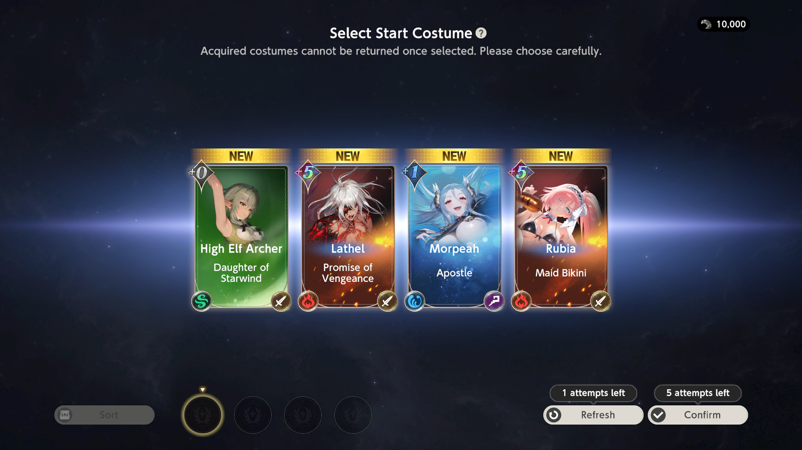

As for the fifth pick, you're allowed to take almost every costume from the game as Wildcard Selection, except **collab characters you do not own**. 
??? note "Image of Wildcard Selection screen"
    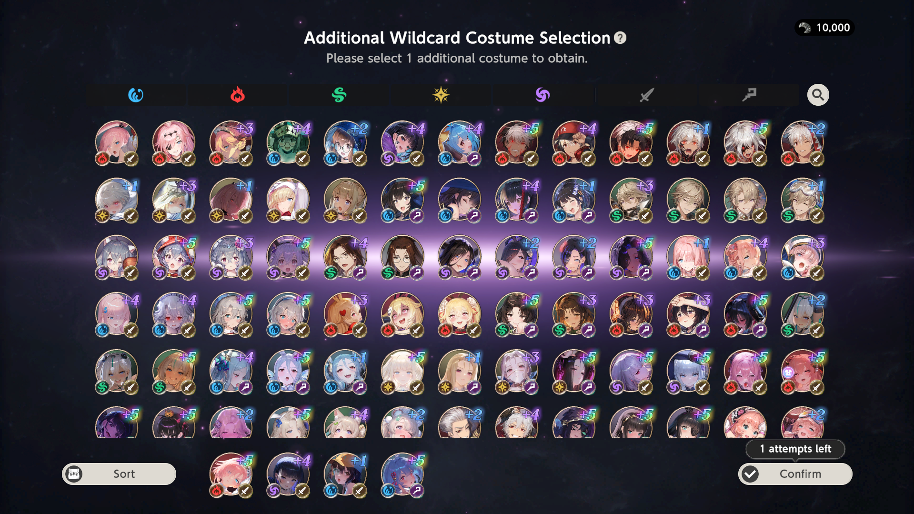

!!! example "Some rules about costumes"
    1. **Owned costumes in your account copy their dupes count (+0 ~ +5), [Potential Liberation](../character-info/potential-liberation.md) and Engraving & Awakening.**
    2. **Costumes <u>DO NOT</u> copy their gear equipped.**
    3. **Brown Dust II Exclusive costumes can appear in both Normal and Wildcard Selections. As mentioned earlier, <u>collab costumes</u> cannot appear / be chosen unless you own them.**
    4. **In following Normal Selections, first 2 choices for costumes is from your already owned characters, last 2 choices are always new. That means it can be worth to obtain different costume of desired character to have a chance to obtain needed costume sooner.**

#### 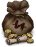{ .icon-header } **Tower of Salvation Shop**

<!--Evil Castle — one of 5 content packs available to you after clearing Normal difficulty of Story Pack 4. The castle's main content consists of 5 towers: Tower of Pride, Tower of Desire, Tower of Salvation, Tower of Wrath and Tower of Jealousy.
Starting from the simplest tower, Tower of Desire, which is often treated as general content. It consists of 200 floors, each having rewards. Enemies share one property each for 10 floors, then property changes. 
To move to the next stage, you only need to win the battle. There are 2 additional challenges you can try to complete to gain additional resources.
Tower of Wrath and Tower of Jealousy are 100 floors each with neutral property enemies. Moreover, in Tower of Wrath enemies are immune to Physical damage, and in Tower of Jealousy enemies are immune to Magical damage, forcing you to eventually build both teams if you want all rewards. Levels from 41 to 50 are much harder due to reduced buffs by 70% so you really want to have strong teams to complete these two!    
Tower of Pride, our next tower, differs from previous ones. This tower consists of 6 floors, each having its own property. Each floor consists of 4 normal battles and one boss fight. 
Your task in this tower is getting as many points as possible by clearing each floor in the least amount of turns possible, using fully healed characters with the correct properties, and having a costume deal 1 million total damage to the enemies. Based on the calculated total score, you’ll get Ancient Crystals each day. It is important to get max score since this resource is really important in the late game.

Tower of Salvation is a unique one. It’s seasonal and resets each 4 weeks. It also  consists of 10 levels, but each level has its own map you need to complete. It can remotely remind you of any roguelike if you have played them. Main gameplay consists of getting useful costumes, winning battles, getting artifacts and, finally, buying stuff in shops. 
Winning normal battles give you the option to choose 1 costume out of 4, winning elite and boss battles — 1 artifact out of 4.
Artifacts are items that can benefit your whole team by additional effects. Their choice depends on who you have in your roster. You can also combine some of them to get more powerful artifacts.
In shops you can buy new and upgrade existing costumes, as well as heal your team and buy powerful artifacts. This tower is so complex it needs a separate video to completely cover it — if you want the Tower of Salvation complete guide, write down in the comments!-->
