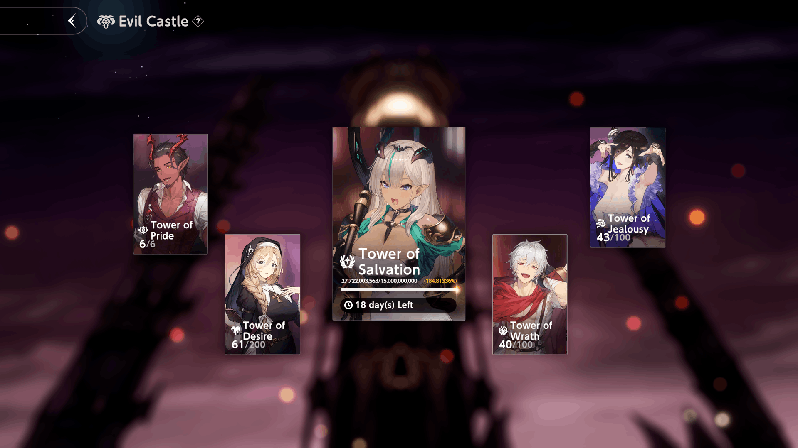
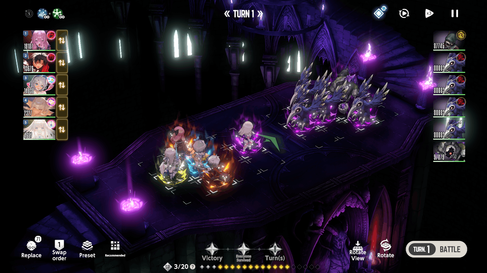
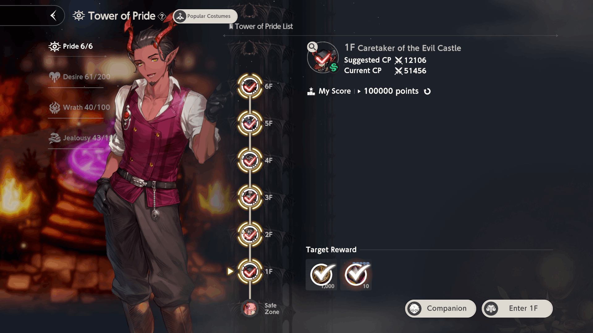
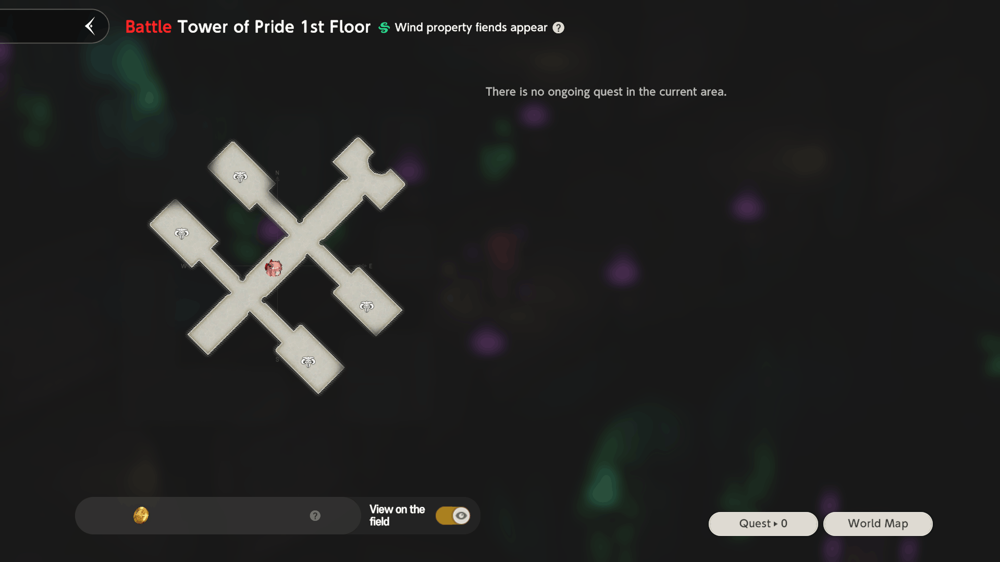

## **Overview**

Evil Castle - PvE mode, offering both single-time and repetitive content.

!!! abstract "Unlock Requirement"
    Clear **Story Pack 4 "Cat Daddy" (Normal Diffuculty)**.

**Evil Castle Consists of 5 Towers:**   
<table>
    <tr>
        <td><b><a href="#tower-of-pride">Tower of Pride</a></b></td><td><b><a href="#tower-of-desire">Tower of Desire</a></b></td><td><b>Tower of Salvation</b></td><td><b>Tower of Wrath</b></td><td><b>Tower of Jealousy</b></td>
    </tr>
</table>

---

### { .icon-header } **Tower of Desire**

Often considered to be a general content. 

!!! info ""
    * **Height**: 200 floors
    * **Enemy Property**: Enemies share one **Property** for 10 floors, then it changes.
    * **Progression:** To advance, you just need to win the battle. Completing the 2 optional challenges per floor grants extra resources.

!!! info "Tower Rewards"

    * **Each 10th Floor:** 1 {{ Draw_Ticket }}, 150 {{ Dia }}, 10 {{ Ancient_Crystal }}
    * **Each 5th Floor:** 1 {{ Draw_Ticket }}, 100 {{ Dia }}, 5 {{ Ancient_Crystal }}
    * **Rest Floors:** 1 {{ Draw_Ticket }}, 30 000 {{ Gold }}, 5 {{ Cooked_Rice }}

<figure markdown>

<figcaption>Tower of Desire Menu</figcaption>

</figure>

<figure markdown>

<figcaption>Tower of Desire Battle Screen</figcaption>

</figure>

### { .icon-header } **Tower of Pride**

Tower of Pride is a unique Tower, offering **daily** rewards based on your score. 

!!! info ""
    * **Height**: 6 floors
    * **Enemy Property**: Enemies share one **Property** each floor. 
        * <i>Note: Enemies do not have Light property completely.</i>

???+ note "Tower of Pride Scoring System *( \[ \+ Score ] — Boss Values )*"
    === "Floor 1"
        * **Entile at least 4 character(s) with Fire prorerty: +2000 \[\+4000\]**
        * **Win the battle within 1 turns or less: +1500 \[\+3000\]**
        * **Win the battle within 3 turns or less: +1000 \[\+2000\]**
        * **Win the battle within 5 turns or less: +500 \[\+1000\]**                        
    === "Floor 2"
        * **Entile at least 4 character(s) with Light prorerty: +2000 \[\+4000\]**
        * **Win the battle within 1 turns or less: +1500 \[\+3000\]**
        * **Win the battle within 3 turns or less: +1000 \[\+2000\]**
        * **Win the battle within 5 turns or less: +500 \[\+1000\]** 
    === "Floor 3"
        * **Entile at least 4 character(s) with Water prorerty: +2000 \[\+4000\]**
        * **Win the battle within 1 turns or less: +1500 \[\+3000\]**
        * **Win the battle within 3 turns or less: +1000 \[\+2000\]**
        * **Win the battle within 5 turns or less: +500 \[\+1000\]**
    === "Floor 4"
        * **Entile at least 4 character(s) with Light prorerty: +2000 \[\+4000\]**
        * **Win the battle within 1 turns or less: +1500 \[\+3000\]**
        * **Win the battle within 3 turns or less: +1000 \[\+2000\]**
        * **Win the battle within 5 turns or less: +500 \[\+1000\]** 
    === "Floor 5"
        * **Entile at least 3 character(s) with Wind prorerty: +2000 \[\+4000\]**
        * **Win the battle within 1 turns or less: +1500 \[\+3000\]**
        * **Win the battle within 3 turns or less: +1000 \[\+2000\]**
        * **Win the battle within 5 turns or less: +500 \[\+1000\]**
    === "Floor 6"
        * **Entile at least 2 character(s) with Light prorerty: +1750 \[\+3500\]**
        * **Entile at least 2 character(s) with Darkness prorerty: +1750 \[\+3500\]**
        * **Win the battle within 3 turns or less: +1000 \[\+2000\]**
        * **Win the battle within 5 turns or less: +500 \[\+1000\]**
    ---
    ???+ warning "IMPORTANT"
        Except tasks above, there are also so called <u>**Evaluation points**</u>

        To get maximum of those, you need to:
        
        * **Deal 1,000,000 Damage by a single unit in a single turn**
        * **Complete the fight in 1 turn**
        * **Have your current team with maximum HP**

<figure markdown>

<figcaption>Tower of Pride Menu</figcaption>

</figure>

<figure markdown>

<figcaption>Tower of Pride Battle Room</figcaption>

</figure>

<figure markdown>

<figcaption>Tower of Pride Battle Room Map</figcaption>

</figure>

<figure markdown>

<figcaption>Tower of Pride Battle</figcaption>

</figure>

<figure markdown>

<figcaption>Tower of Pride Boss Room</figcaption>

</figure>

<figure markdown>

<figcaption>Tower of Pride Boss Room Map</figcaption>

</figure>

<!--Evil Castle — one of 5 content packs available to you after clearing Normal difficulty of Story Pack 4. The castle's main content consists of 5 towers: Tower of Pride, Tower of Desire, Tower of Salvation, Tower of Wrath and Tower of Jealousy.
Starting from the simplest tower, Tower of Desire, which is often treated as general content. It consists of 200 floors, each having rewards. Enemies share one property each for 10 floors, then property changes. 
To move to the next stage, you only need to win the battle. There are 2 additional challenges you can try to complete to gain additional resources.
Tower of Wrath and Tower of Jealousy are 100 floors each with neutral property enemies. Moreover, in Tower of Wrath enemies are immune to Physical damage, and in Tower of Jealousy enemies are immune to Magical damage, forcing you to eventually build both teams if you want all rewards. Levels from 41 to 50 are much harder due to reduced buffs by 70% so you really want to have strong teams to complete these two!    
Tower of Pride, our next tower, differs from previous ones. This tower consists of 6 floors, each having its own property. Each floor consists of 4 normal battles and one boss fight. 
Your task in this tower is getting as many points as possible by clearing each floor in the least amount of turns possible, using fully healed characters with the correct properties, and having a costume deal 1 million total damage to the enemies. Based on the calculated total score, you’ll get Ancient Crystals each day. It is important to get max score since this resource is really important in the late game.

Tower of Salvation is a unique one. It’s seasonal and resets each 4 weeks. It also  consists of 10 levels, but each level has its own map you need to complete. It can remotely remind you of any roguelike if you have played them. Main gameplay consists of getting useful costumes, winning battles, getting artifacts and, finally, buying stuff in shops. 
Winning normal battles give you the option to choose 1 costume out of 4, winning elite and boss battles — 1 artifact out of 4.
Artifacts are items that can benefit your whole team by additional effects. Their choice depends on who you have in your roster. You can also combine some of them to get more powerful artifacts.
In shops you can buy new and upgrade existing costumes, as well as heal your team and buy powerful artifacts. This tower is so complex it needs a separate video to completely cover it — if you want the Tower of Salvation complete guide, write down in the comments!-->
