# **Mirror Wars**

Mirror Wars is the PvP mode where you fight other players' defense teams. 

!!! abstract "Unlock Requirement"
    Clear **Story Pack 3 "Mist Man" (Normal Difficulty)**.

## **Overview**
* **Rankings:** There are **11 ranks** total (Bronze to Champion).
* **Rewards:** You earn **{{ pvp_medals }}** per battle and **{{ dias }}** as season rewards.
* **Season Duration:** 1 Week (Monday Reset to Sunday).
    * *Note:* There is a 9-hour "Settlement Period" on Sunday before reset (starting at {{ time('15:00') }}) during which you cannot attack.

??? info "Rankings"
    | Rank 	| Icon 	| Requirenments 	| Ranking Reward 	|
    |:---:	|:---:	|:---:	|:---:	|
    | Bronze 	| 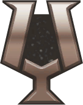{ .h-60 }	| Victory Points 1000 or above 	| 400 {{ dias_pic }} 	|
    | Silver III 	| 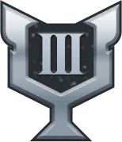{ .h-60 }	| Victory Points 1050 or above 	| 400 {{ dias_pic }} 	|
    | Silver II 	| 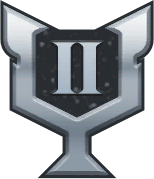{ .h-60 } 	| Victory Points 1100 or above 	| 400 {{ dias_pic }} 	|
    | Silver I 	| 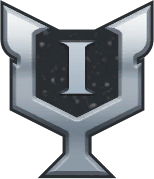{ .h-60 } 	| Victory Points 1200 or above 	| 400 {{ dias_pic }} 	|
    | Gold III 	| 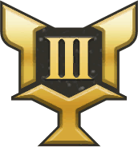{ .h-60 } 	| Victory Points 1300 or above 	| 440 {{ dias_pic }} 	|
    | Gold II 	| 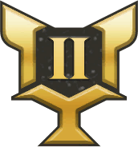{ .h-60 } 	| Victory Points 1400 or above 	| 470 {{ dias_pic }} 	|
    | Gold I 	| { .h-60 } 	| Victory Points 1500 or above 	| 500 {{ dias_pic }} 	|
    | Platinum III 	| 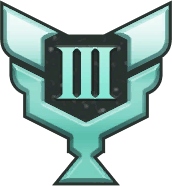{ .h-60 } 	| Victory Points 1600 or above 	| 540 {{ dias_pic }} 	|
    | Platinum II 	| 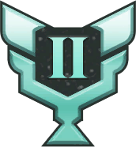{ .h-60 } 	| Victory Points 1700 or above 	| 570 {{ dias_pic }} 	|
    | Platinum I 	| 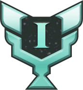{ .h-60 } 	| Victory Points 1800 or above 	| 600 {{ dias_pic }} 	|
    | Ruby III 	| 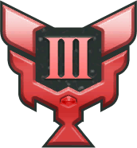{ .h-60 } 	| Victory Points 1900 or above 	| 640 {{ dias_pic }} 	|
    | Ruby II 	| 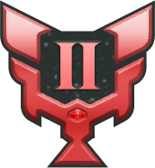{ .h-60 } 	| Victory Points 1950 or above 	| 670 {{ dias_pic }} 	|
    | Ruby I 	| 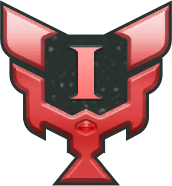{ .h-60 } 	| Victory Points 2000 or above 	| 700 {{ dias_pic }} 	|
    | Dia III 	| 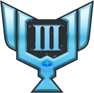{ .h-60 } 	| Victory Points 2100 or above 	| 740 {{ dias_pic }} 	|
    | Dia II 	| 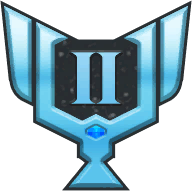{ .h-60 } 	| Victory Points 2200 or above 	| 770 {{ dias_pic }}   *Cheers! Granhildr 1* sticker 	|
    | Dia I 	| 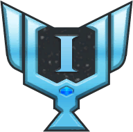{ .h-60 } 	| Victory Points 2300 or above 	| 800 {{ dias_pic }}   *Cheers! Granhildr 1* sticker 	|
    | Sapphire III 	| { .h-60 } 	| 3001 ~ 5000 place 	| 840 {{ dias_pic }}   *Cheers! Granhildr 1* sticker 	|
    | Sapphire II 	| 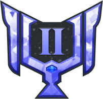{ .h-60 } 	| 2001 ~ 3000 place 	| 870 {{ dias_pic }}   *Cheers! Granhildr 1* sticker 	|
    | Sapphire I 	| 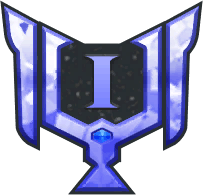{ .h-60 }	| 1001 ~ 2000 place 	| 900 {{ dias_pic }}   *Cheers! Granhildr 1* sticker 	|
    | Master III 	| 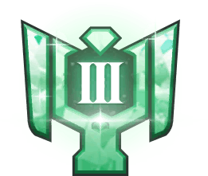{ .h-60 } 	| 501 ~ 1000 place 	| 1000 {{ dias_pic }}   *Cheers! Granhildr 1* sticker 	|
    | Master II 	| 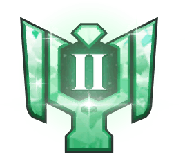{ .h-60 } 	| 201 ~ 500 place 	| 1100 {{ dias_pic }}   *Cheers! Granhildr 1* sticker 	|
    | Master I 	| { .h-60 } 	| 101 ~ 200 place 	| 1200 {{ dias_pic }}   *Cheers! Granhildr 1* sticker 	|
    | Grandmaster III 	| { .h-60 }  	| 51 ~ 100 place 	| 1300 {{ dias_pic }}   *Cheers! Granhildr 2* sticker   *Mirror Wars Bronze Trophy*	|
    | Grandmaster II 	| { .h-60 } 	| 21 ~ 50 place 	| 1400 {{ dias_pic }}   *Cheers! Granhildr 2* sticker   *Mirror Wars Bronze Trophy* 	|
    | Grandmaster I 	| { .h-60 } 	| 11 ~ 20 place 	| 1500 {{ dias_pic }}   *Cheers! Granhildr 2* sticker   *Mirror Wars Bronze Trophy* 	|
    | Challenger III 	| 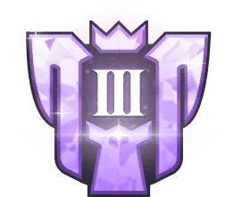{ .h-60 } 	| 6 ~ 10 place 	| 1600 {{ dias_pic }}   *Cheers! Granhildr 3* sticker   *Mirror Wars Silver Trophy* 	|
    | Challenger II 	| 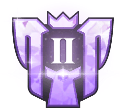{ .h-60 }	| 3rd ~ 5th place  	| 1700 {{ dias_pic }}   *Cheers! Granhildr 3* sticker   *Mirror Wars Silver Trophy* 	|
    | Challenger I 	| 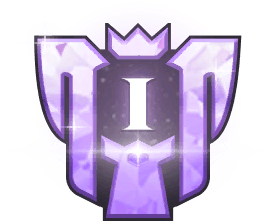{ .h-60 } 	| 2nd place 	| 1800 {{ dias_pic }}   *Cheers! Granhildr 3* sticker   *Mirror Wars Silver Trophy* 	|
    | Champion 	| { .h-60 } 	| 1st place 	| 2000 {{ dias_pic }}   *Cheers! Granhildr 4* sticker   *Mirror Wars Gold Trophy* 	|

!!! tip 
    Do your Mirror Wars fights daily, regardless of your goals in the mode! You get currency regardless of wins or losses.

## **Combat Rules**
Mirror Wars works differently than most of PvE.

* **Offense:** You start with **5 SP**.
* **Defense:** You start with **6 SP**.
* **SP Regen:** You gain **6 SP** every turn.

!!! tip "Strategy Tip"
    Because you have limited starting SP, you must build a team with **low SP costs**. 
    
    You cannot use your expensive "nuke" skills on Turn 1 like you do in Story Mode!

??? example "Preemptive Costume Mechanic Explained"
    Some costumes have the ability to be used preemptive. They are used on so-called **0th turn**, which will still take SP, leaving you with less SP for following turns. 

    !!! example ""
        For example, using maxed **Comeback Idol Granhildr** preemptively on defense will give your team 6 (Initial) - 5 (Costume Preemptive) + 6 (Turn 2 Gain) = 7 SP on Turn 2. 

## **Blood Cocktails**
Each fight costs entry tickets called **{{ cocktails }}**

!!! info ""
    
    * **Daily Refill:** 40 Cocktails (Resets at {{ time('00:00') }})
    * **Cost:** 1 per fight
    * **Batch:** Up to 10x per fight

    ---

    * **Other Sources**: Events, Shop (40 {{ cocktails_pic }} for 170 {{ dias_pic }} )

!!! warning "Time-management tip"
    40 battles a day is time-consuming! Use the **Repeat Battle** menu to set Cocktail consumption to **10 times**. 
    
    * You will fight once, but get rewards (and spend cocktails) as if you fought 10 times.
    * This, however, does not increase Victory Points compared to 1 battle.
    
    ??? "Image Guide"
        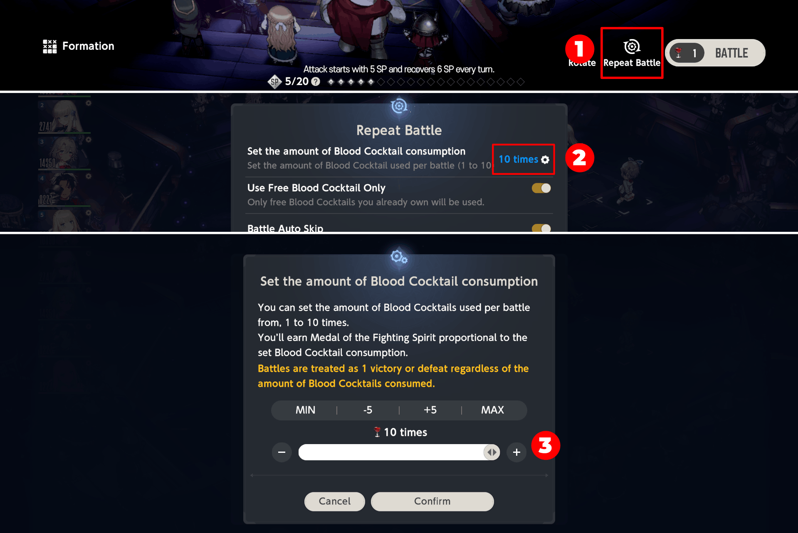

---

!!! abstact "Related Missions"
    * **Season Pass**: Complete a battle in the Mirror Wars
        * **Reset**: Daily
        * **Reward**: 200 {{ pvp_medals_pic }}
        * **Pass EXP**: 30