# **Battle System**

Brown Dust II is a turn-based strategy in which you have ability to position your characters, as well as choose character's skills in order to defeat the enemies.

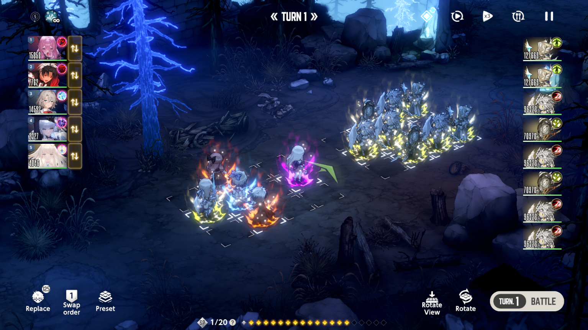

## **Basics**

!!! example "Turns mechanic"
    * For all PvE content, you attack on **odd turns (1, 3, 5, ...)**, while enemy attacks on **even turns (2, 4, 6, ...)**.
    * During turns, you don't have to do anything; characters use skills automatically; **all preparation (positioning, skills choices) must be made pre-turn**.
    * You can make those preparations only **pre-turns**. Enemy turn is followed instantly after yours.
    * Turn progression only goes after you confirm your choices with "Turn X Battle" button in the bottom right corner of the battle screen.

## **Battlefield**

!!! absract "Grid System"
    * In general content (such a Story or [Evil Castle Towers](../content-packs/evil-castle.md)), you have ability to use **5 characters** on the field.
    * Field is a <u>**3x4 rectangular grid**</u>, in which you can place your characters however you like.
        * To swap character positioning, click and drag the chibi model of a character to the needed tile.
    !!! warning ""
        **Guild Raid** offers **5x5 square grid** and 7 characters, while **Fiend Hunter** uses **irregular grid**, but same 5 characters per team. Golden Colosseum, on the other hand, has field changing depending on season from **3x3 square** to **5x5 square** with different amount of characters allowed. 

!!! abstact "Targetting Logic"
    Before undertanding where would you character attack land, you need to undertand how character targets the enemy.

    * Each costume has own **Range** — tiles that are affected by the action of the costume. 
    * For each costume (except supports with {.icon} Range), there is **Main Target** which is displayed by {.icon} down arrowhead. **Main target is the one that actually gets targeted by your character, and rest AoE impact is calculated based on position of that Main Target.**

    ---

    As for Main Target, there are two main types of determining one.

    * First is **Very Front**, meaning your character will target the closest enemy in the same column.
    * Second is **Vault**, meaning your character will target **second** closest enemy in the same column, "vaulting" over first one. 
        * If there's only one enemy in the column, it will be targeted instead.

    You can check Target type and Costumes AoE either in Compainion tab or directly in the battle by clicking the character card. 

    ??? note "Image Guide"
        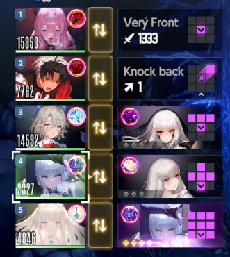

## **Battle UI**

=== "{ .icon-list }"
    ### **Environmental Effects** { #__tabbed_1_1 }
    This icon itself does not mean anything, but next to this icon all **environmental effects** are listed. They can be (but not limited to): 

    * { .icon } **Collection Bonus**
    * { .icon } **Death Time Effect**
    * { .icon } **[Evil Castle](../content-packs/evil-castle.md) Environmental effects**

=== "{ .icon-list }"
    ### **Auto Skill** { #__tabbed_1_2 }
    This features automatically picks the costume to activate in the following turn.

    !!! example ""
        * **It tries to activate costumes in order of characters in a team (from first to the last).**
            * It also tries to activate costumes shown in Compainion / Pre-battle screens first, meaning it will keep turn 1 settings almost every time.
        * **If you do not have enough SP, skill (costume) will be not picked.**
        * **If you do have SP but for cheaper costume only, that costume will be picked instead.**

    To reselect costume choice, simply click on the character and choose different costume. 

    Overall this feature is considered to be a time-saver, since setting up skills yourself is way bigger hustle. Aside of that, it is flexible feature which doesn't lock your selected skill order, so you should have no issues.

=== "{ .icon-list }"
    ### **Auto Battle Feature** { #__tabbed_1_3 }
    This feature allows you to complete battles automatically. 

    !!! example ""
        * **It locks your input from the battle completely, so in case you want to change anything, you must disable auto-battle first.**
        * It uses initial positioning and Auto Skill Feature.
        * It has a small countdown before launching the battle. 
    It is **NOT** recommended to use Auto Battle, because 

    * It takes longer time than actually just pressing battle button with no preparation
    * It does not care about the enemy and positioning, meaning you will likely run into issues sooner or later.
    * <u>**Auto Battle does not teach you how to be a good playere.**</u>

=== "{ .icon-list }"
    ### **Game Speed Feature** { #__tabbed_1_4 }
    With that button, you can change the speed your battles are going at. **Minimum is x1, maximum is x3**.
    
    To switch, simply press the button few times.

=== "{ .icon-list }"
    ### **Autofeed Feature** { #__tabbed_1_5 }
    This feature allows to heal minor damage by consuming cooked (and raw) food

    While it sounds good on paper and no longer requires people go to the Inn, it is simply not worth the result. 

=== "{ .icon-list }"
    ### **Pause Feature** { #__tabbed_1_6 }
    Quite self-explanatory feature allowing to make a pause during your battle.

    Here, you can:

    * Adjust Skill cutscenes display
    * Change Volume settings
    * Check { .icon } Battle Statistics
    * **Restart the battle or previous turn**
        * *You cannot rollback to previous turn in [**Tower of Salvation**](../content-packs/evil-castle.md#tower-of-salvation).*
    * Run away from the battle.

    ??? note "Pause Menu Image"
        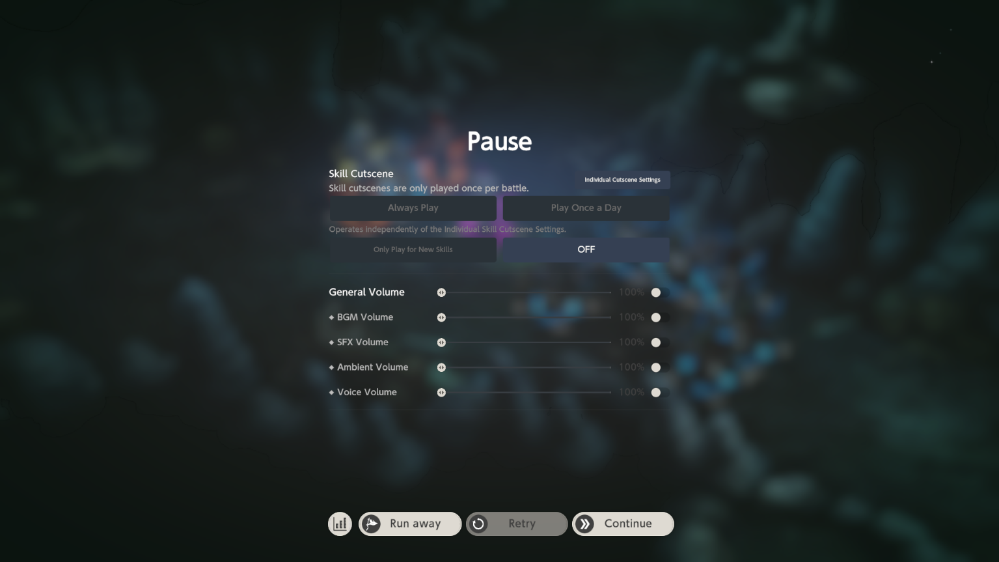 
---

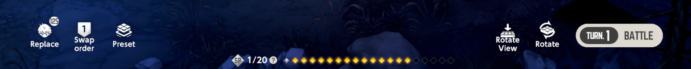

=== "{ .icon-list }"
    ### **Replace Feature** { #__tabbed_2_1 }
    Feauture allowing you to replace your characters during battle preparation.
    
    To replace a character, pick it from the list and tap on the character you want to replace.
    ??? note "Image Guide"
        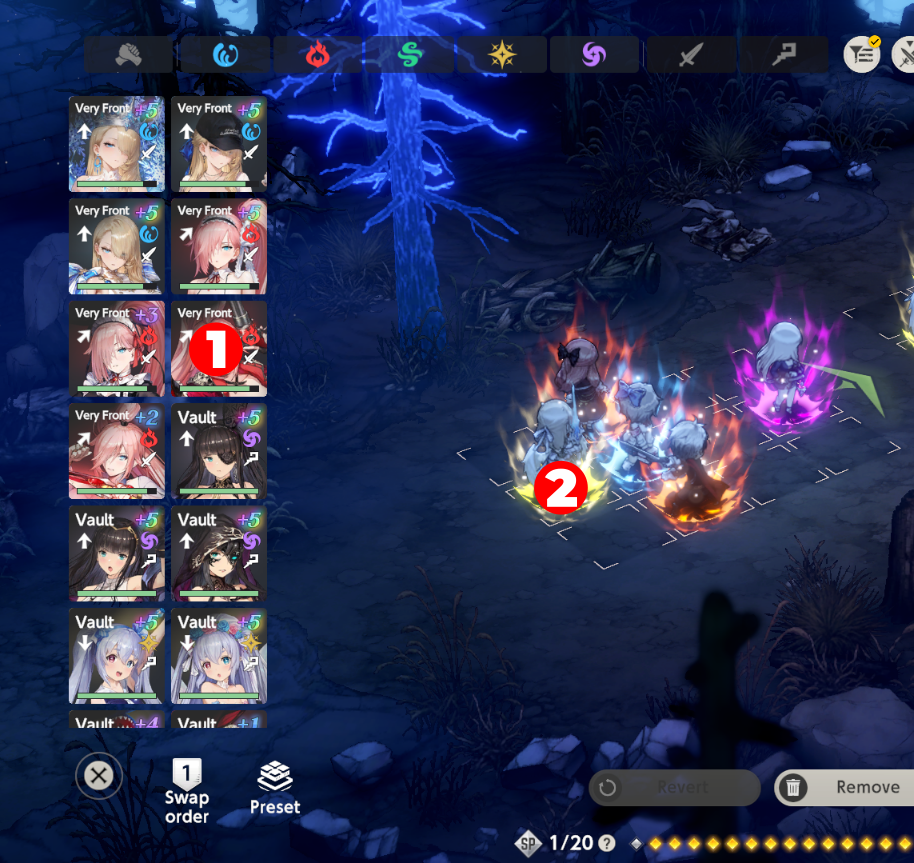
    !!! example ""
        * You can **filter characters** to find the needed ones faster by using **Property Filter** on top or filter button on the top as well.
        * In case you need **specific knockback**, you can check it via icon ({{ Knockback }}) on each character.
        * You can also **add characters instead of replacing** in case you do not have max amount on the field. In this case, **click on empty grid cell** with chosen character to place them.
        * **You cannot replace characters on Turn 3 onwards, except [Tower of Salvation](../content-packs/evil-castle.md#tower-of-salvation).**
    ### **Borrow Feature** { #__tabbed_2_1 }
    In some fights, you can use your Friend Support units to help you beat the fight. 
    The idea is completely the same with the exception of pressing one more button ({.icon}).
    ??? note "Image Guide" 
        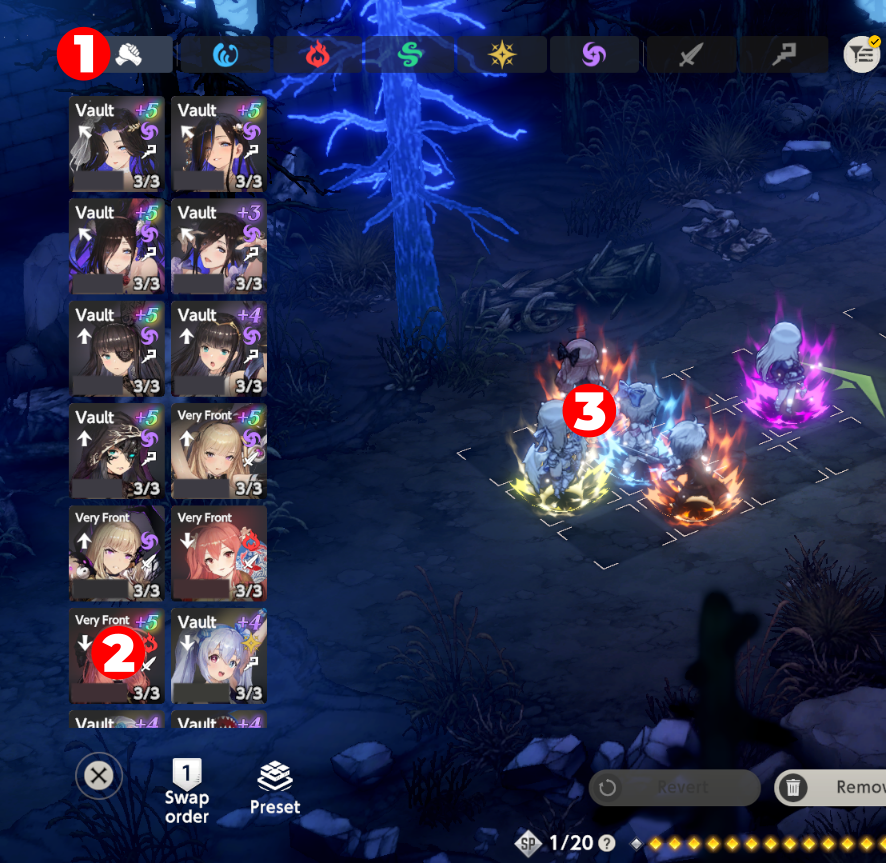
    !!! example ""
        * Borrow is limited to **3 borrows per day <u>per friend</u>**. That means if you have maximum friends (30), you can borrow up to 90 times per day.
        * **Borrow is available in:**
            * Normal Difficulty, Hard Difficulty, NPC Quests of Story Packs
            * Hard Difficulty of Character & Event Packs          
            * Normal & Challenge Battles in Season Events
            * Hunting Grounds & [Path of Adventure Content Pack](../content-packs/path-of-adventure.md) battles.
        * You **cannot** have **2 same characters** in a team.
        * You can borrow **only 1 character per fight**.

=== "{ .icon-list }"
    ### **Swap Order Feature** { #__tabbed_2_2 }
    This feature allows you to adjust the order in which your characters act. It has 2 modes: {.icon} **Insert** and {.icon} **Replace**.
    
    * {.icon} **Insert mode** allows you to alter your order by inserting desired character in a sequence. To do that, drag character on others.
        * If you drag **from bottom to top**, you will put chosen character **before** the character you drag onto.
        ??? note "Image Guide"
            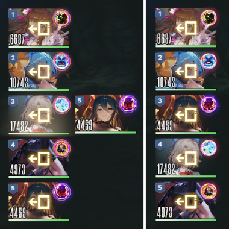
        * If you drag **from top to bottom**, you will put chosen character **after** the character you drag onto.
        ??? note "Image Guide"
            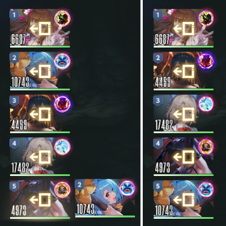

    * {.icon} **Replace mode** allows you to change order of 2 costumes. To do that, simply drag a character onto another to switch the order.
    ??? note "Image Guide"
        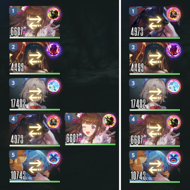
    
    !!! tip "Replace Shortcut"
        { align=right }
        In order to save time, you can access to **Replace** feature from main battle menu via icon next to the right of the character cards. It functions completely identical to the feature explained above.
        ??? note "Image Guide"
            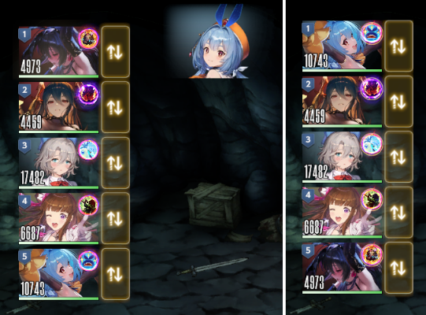

=== "{ .icon-list }"
    ### **Preset Feature** { #__tabbed_2_3 }
    This feature allows you to quick load pre-saved teams.
    !!! example ""
        * **This includes characters, gear, order and positioning.**
        * If preset gear was used by different characters, activating a preset will unequip those gear pieces and equip on your team.
        * Preset name and icon can be customized for your needs.
        * You can delete or rewrite old presets in case you do not need them anymore.
        * There are total of 12 preset slots.
    In addition to presets, you can use **own recently used teams** in the second tab of preset menu.

    ---

    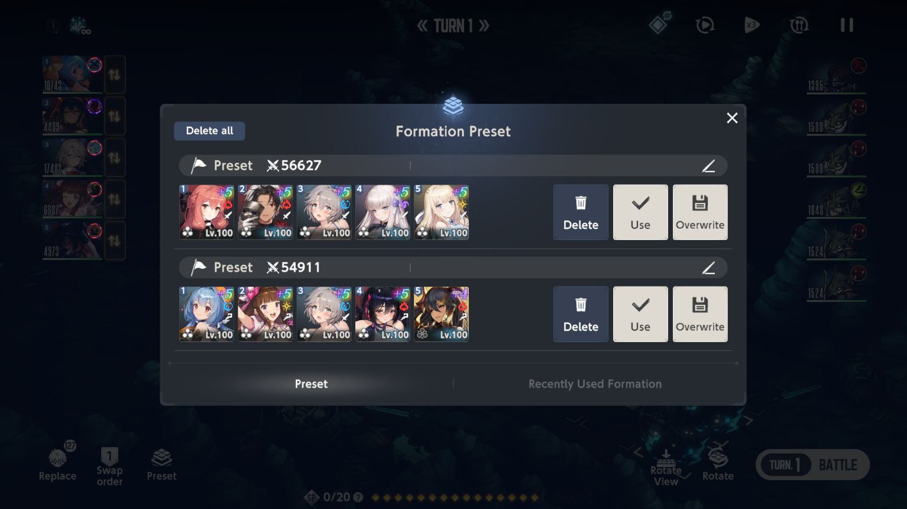
=== "{ .icon-list }"
    ### **SP Bar** { #__tabbed_2_4}
    SP bar displays your Skill Points which you use for using costumes' abilities.

    !!! example ""
        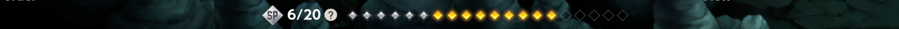
        
        ---

        * {.icon} are available Skill Points.
        * {.icon} are Skill Points which will be used in the following turn, if you press Battle.
        * {.icon} are Skill Points which are not available for use, or, in other words, you do not have them.
=== "{ .icon-list }"
    ### **Rotate View Feature** { #__tabbed_2_5 }
    This feature allows you to change battlefield view to the top one and replacing surrounding backgrounds, allowing you to easily distinguish otherwise grouped enemies or allies. In this mode, your units are always on the left side, while enemy is on the right.
            
    ---

    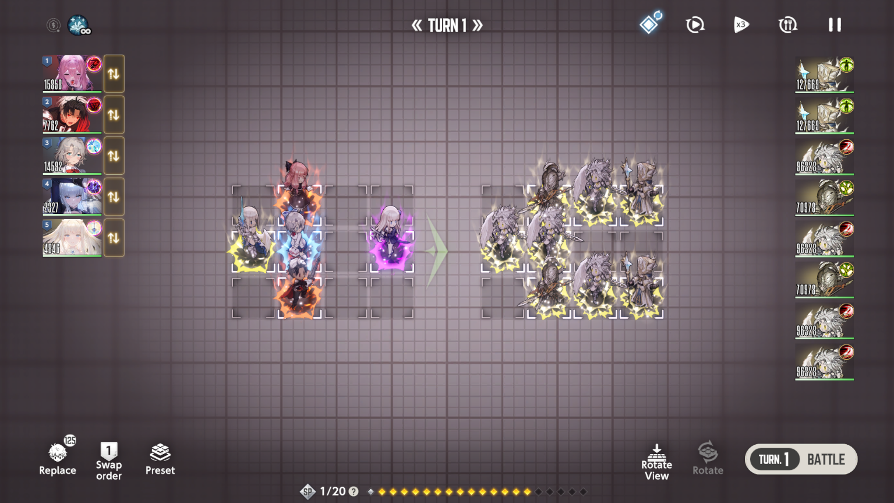 
        
    ---

    To go back to original view, simply press the same button once again.
=== "{ .icon-list }"
    ### **Rotate Feature** { #__tabbed_2_6 }
    This feature allows you rotate the field, changing your and enemy visual positioning while keeping aethetics of surroundings. This can be useful for distinguishing grouped enemies, but [**Rotate View**]( #__tabbed_2_5 ) is better for this matter. You cannot rotate the field with special bosses on it like Fiend Hunter or Guild Raid ones.
    ??? note "Feature Showcase"
        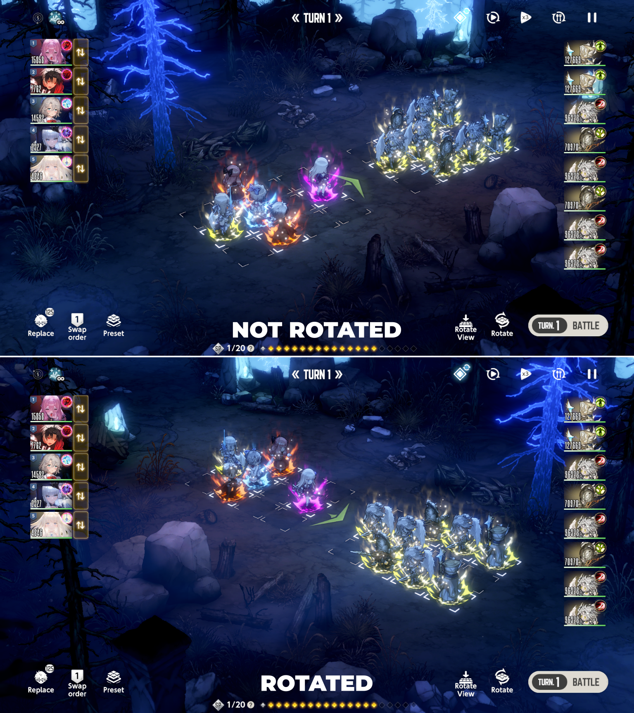

<!--Brown Dust II is a turn-based strategy game, where you use your characters in order to defeat the enemy. 
Most common ways to start the battle are either activating it via quests or touching the enemy in the battle zones of packs.
Your team usually consists of 5 characters, which you can change pre-battle. Once you press “Battle”, you won’t be able to change your team. 
Battle goes by turns, as you could already guess, enabling your actions on odd turns and enemies’ on even ones. 
Each your turn, you can swap positions of your characters on the field by dragging them to needed spot and choose to either use a costume skill, knockback attack or just perform a basic hit. To do that, you need to press the character or their corresponding panel on the left and pick your desired action. Aside of that, you’re free to change the order in which they move. To do that, hold and drag green arrows on the right of character tiles. 
After confirming your choice, characters will automatically attack enemies based on your set actions. Usually characters attack opposing enemy (e.g. in the same column). However, if there is no enemy on the same column, expect to hit the column to the right instead. So, it’s possible to attack the furthermost right column from the furthermost left one. 
When you press the character, sometimes you can see quite a lot of lines connecting your characters and enemies. These are meant to help you understand who will be affected by the skill and who will target that character in the next turn. 
In addition to this, you can see a knockback direction or the damage that your character will inflict by their attack. If your damage is enough to kill the enemy, K.O. will be shown instead. Please keep in mind that this damage is shown without calculating the impact of other characters you use in the same turn so often those numbers will be much higher once you launch an attack. 
To keep the game somewhat fair, costumes activations rely on Skill Points (SP) — so you can’t blast expensive costumes together on the turn 1. Each basic attack or knockback gives you 1 SP, as well as some costumes can increase the amount of SP you have. A few costumes, however, drain additional SP from your team, so be aware of that! 
On turn 10, to prevent the game from having infinite battles, Death Time is introduced. It doesn’t mean that you’ve lost; instead, some adjustments are made. Each turn forward on, attack will be increased, def reduced, and incoming dmg increased. This can be helpful versus some tough opponents. You actually don’t have any limit afterwards, so if you can survive for long enough, you can deal insane damage with just basic attack.
When your character’s hp reach 0, they become fatigued and can’t continue to fight. In a battle, a tombstone is created in the character's place which can’t be moved by any knockback. To recover the character’s hp, use Inn in Safe Zones of pack or use Revive ability skill.-->